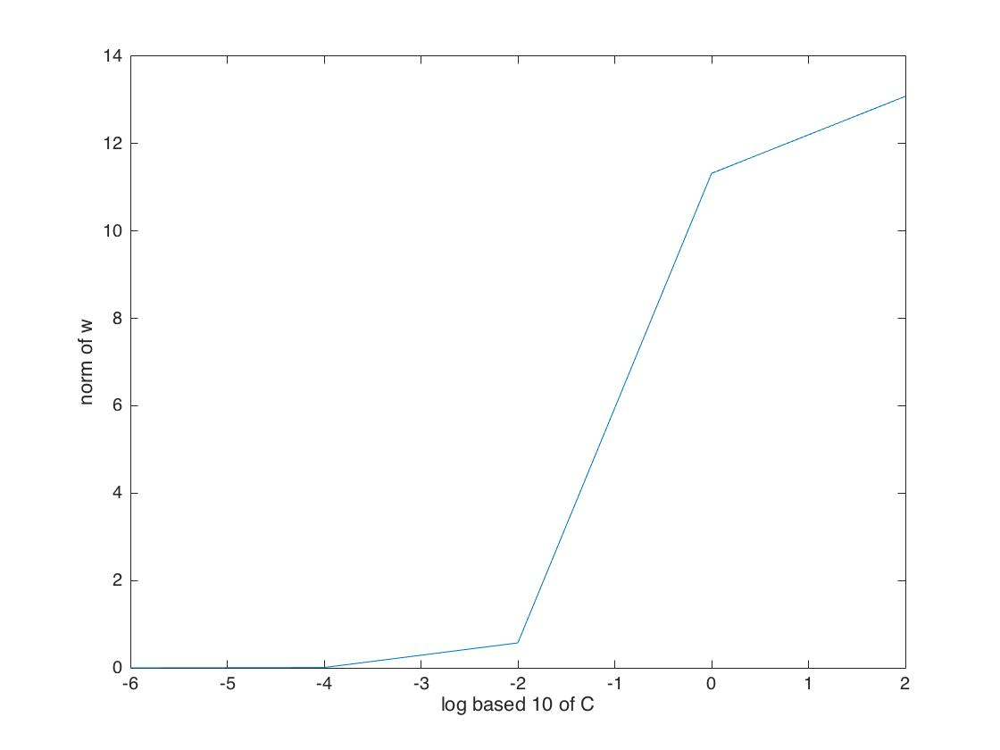
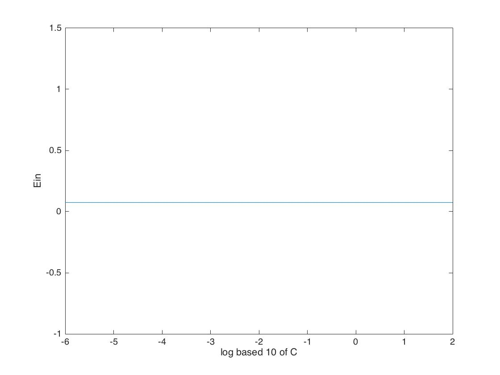
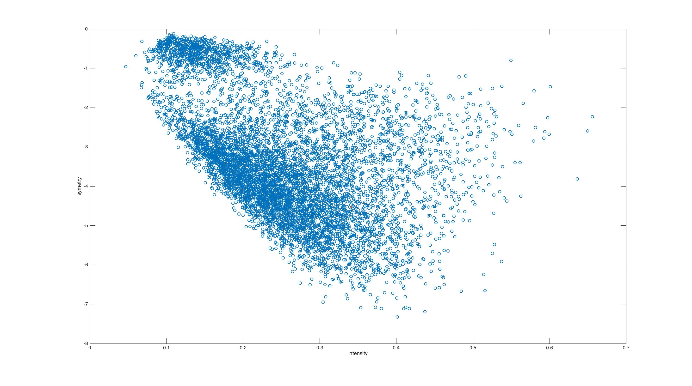
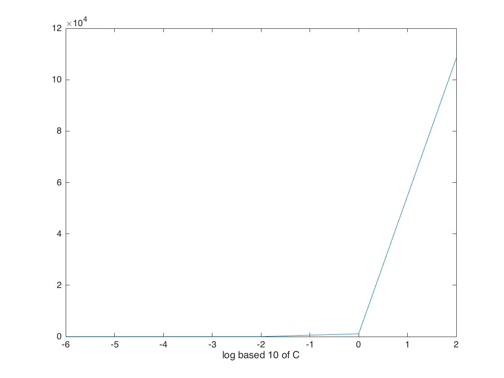
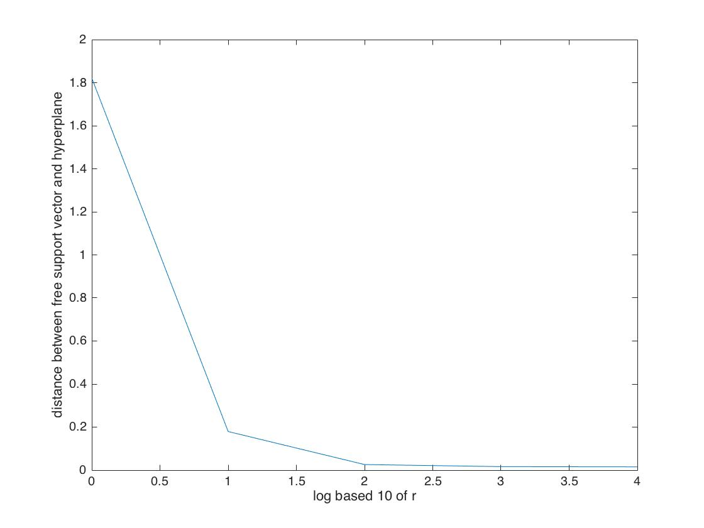
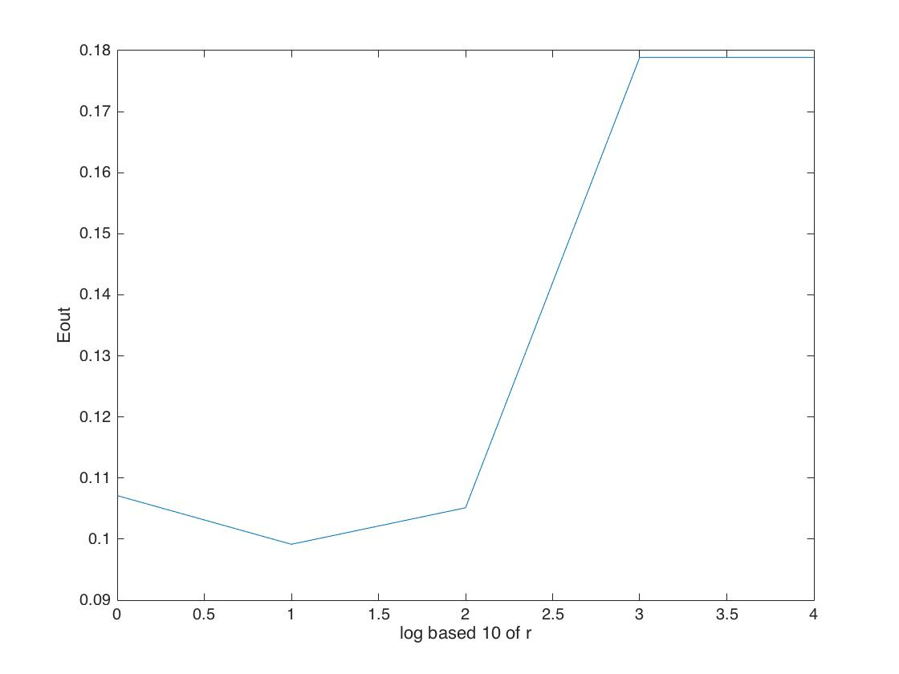
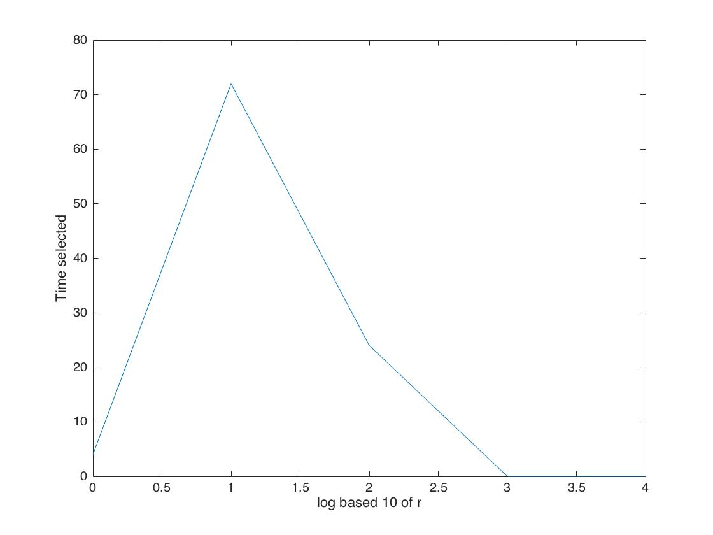

# Machine Learning HW5
##R04922034

1.

One the primary form of linear soft-margin support vector machine, there will be d + 1 +N  variables (d for the feature dimensions , 1 for the constant dimension , N for each margin violations ) , with 2N constraints ( N for prediction to lie within margin violation bound and N for the margin violation to be a non-negative).

2.
	phi1 = @(x) x(2)^2 - 2 * x(1) + 3;  
	phi2 = @(x) x(1)^2 - 2 * x(2) - 3;  
	trans = @(x) [ phi1(x) phi2(x) ];  
	data = load ('2.in');  
	X = data(:,1:2);  
	Y = data(:,3);  
	Q = zeros(3,3);  
	Q (2,2) = 1;  
	Q(3,3 ) = 1;  
	p = zeros(3,1); 
	A = [];  
	for i = 1:7  
	A = [A; Y(i,1)*[1 trans(X(i,:))] ];  
	end
	c = ones(7,1);  
	x = quadprog(Q,p,-A,-c);  
	
x= [-9 2 0]' 
=> 2z1 - 9 =0  	
z1 = 4.5

3.

	data = load ('2.in');  
	X = data(:,1:2);  
	Y = data(:,3);  
	K = @(x1,x2) (1 + x1*x2')^2  
	p = -1*ones(7,1);  
	Q = zeros(7,7);  
	for i = 1:7  
		for j = 1: 7  
			Q(i,j) = Y(i,1)*Y(j,1)*K(X(i,:),X(j,:))  
		end  
	end  
	A = [-eye(7,7)];  
	c = zeros(7,1);  
	Aeq = Y(:,1)';  
	alpha = quadprog(Q,p,A,c,Aeq,0);  
	for i = 1:size(alpha,1)  
		if(norm(alpha(i))>0.00001)  
			fprintf('X1=%d\\tX2=%d\\tY=%d\\n',X(i,1),X(i,2),Y(i));  
		end  
	end  
	
alpha = 
[0.000000000331836   0.703703703733221   0.703703703741753   0.888888889086536   0.259259259324908   0.259259259329173   0.000000000066193]'

support vectors:  
(0,1)	-1  
(0,-1)	-1  
(-1,0)	1  
(0,2)	1  
(0,-2)	1  

4.
	
	data = load ('2.in');  
	X = data(:,1:2);  
	Y = data(:,3);  
	K = @(x1,x2) (1 + x1*x2')^2  
	p = -1*ones(7,1);  
	Q = zeros(7,7);  
	for i = 1:7  
		for j = 1: 7  
			Q(i,j) = Y(i,1)*Y(j,1)*K(X(i,:),X(j,:))  
		end  
	end  
	A = [-eye(7,7)];  
	c = zeros(7,1);  
	Aeq = Y(:,1)';  
	alpha = quadprog(Q,p,A,c,Aeq,0);  
	index = 2;  
	b = Y(index,1);  
	w = zeros(7,1);  
	w(1,1) = Y(index,1);  
	for i = 1:7  
		w = w + [- alpha(i) * Y(i,:) * K(X(i,:),X(index,:));  
				alpha(i)*Y(i);  
				2*alpha(i)*Y(i)*X(i,1);  
				2*alpha(i)*Y(i)*X(i,2);  
				alpha(i)*Y(i)*X(i,1)^2;  
				alpha(i)*Y(i)*X(i,1)*X(i,2);  
				alpha(i)*Y(i)*X(i,2)^2];  
	end  
9*w' = [ -15.000000004272163   0.000000000000002 -16.000000011913638                   0   8.000000001175247                   0   6.000000004272160]'  
curve = (8* x1^2 -16*x1 + 6* x2^2 -15 ) * (1/9)  

5.

The two non-linear curves found in Q2 and Q4 should not be the same because we find these curves w.r.t to different z space transformation.

6.

$$
\begin{aligned}
L(R,c,\lambda) =   \min_{R \in R , c \in Rd}  \max_{\lambda_n >=0} R^2 + \sum\limits_{n=1}^N \lambda_n ( norm(x_n-c,2)^2-R^2)\\  
 Since\\norm(x_n-c,2)^2 - R^2 <=0\\  
 \lambda_n (norm(x_n-c,2)^2 - R^2 ) <=0\\   
\end{aligned}
$$ 
 case 1 : $$norm(x_n-c,2)^2- R^2 < 0$$ $\lambda_n$ should be 0 in order to maximize the result,  
 case 2 : $$norm(x_n-c,2)^2 - R^2 = 0$$ $\lambda_n$ can be any non-negative real number  
 Since in both cases, $$\lambda_n (norm(x_n-c,2)^2 - R^2)$$  will be 0 , the result of min max L(R,c,$\lambda$) will be the same as the result of $$P = min R^2 $$with constraints  
 
7.

Assuming strong duality  
$$ \begin{aligned}
&\frac{\partial L}{\partial c} = d \sum\limits_{n=1}^N \lambda_n (x_n-c)^T (x_n-c) = \sum\limits_{n=1}^N \lambda_n (-2x_n +2c ) =0\\
&\sum\limits_{n=1}^N \lambda_n (x_n - c) = 0\\
&\sum\limits_{n=1}^N \lambda_n x_n = \sum\limits_{n=1}^N c \lambda_n =  c \sum\limits_{n=1}^N \lambda_n\\
&=> if \sum\limits_{n=1}^N \lambda_n \ne 0 , c = (\sum\limits_{n=1}^N \lambda_nx_n) / (\sum\limits_{n=1}^N \lambda_n)\\
\end{aligned}
$$
8.

$$\begin{aligned}
&\frac{\partial L}{\partial R} = 2R - 2\sum\limits_{n=1}^N \lambda_n R\\
&= 2R (1 - \sum\limits_{n=1}^N \lambda_n ) = 0\\
&=> \sum\limits_{n=1}^N \lambda_n =1\\
&7=> c = \sum\limits_{n=1}^N \lambda_n x_n\\ 
L &= R^2 + \sum\limits_{n=1}^N \lambda_n  norm(x_n-c,2)^2 - \sum\limits_{n=1}^N \lambda_n R^2\\  
  &= R^2 (1 - \sum\limits_{n=1}^N \lambda_n) + \sum\limits_{n=1}^N \lambda_n norm(x_n- \sum\limits_{m=1}^N (\lambda_m x_m) ,2)\\  
  &= \sum\limits_{n=1}^N \lambda_n  || x_n - \sum\limits_{m=1}^N \lambda_m  x_m || ^2\\  
\end{aligned}$$
9.

$$\begin{aligned}
L &= \sum\limits_{n=1}^N \lambda_n || x_n - \sum\limits_{m=1}^N \lambda_m x_m || ^2\\  
  &= \sum\limits_{n=1}^N \lambda_n (x_n - c )^T (x_n - c )\\
  &= \sum\limits_{n=1}^N \lambda_n (x_n^Tx_n - 2 x_n^T c + c^2)\\   
  &= (\sum\limits_{n=1}^N \lambda_n x_n^Tx_n)  - 2 \sum\limits_{n=1}^N (\lambda_n x_n^T  c ) + c^2 \sum\limits_{n=1}^N \lambda_n\\  
  &= \sum\limits_{n=1}^N \lambda_n K(x_n,x_n) - 2 \sum\limits_{n=1}^N \lambda_n  x_n^T  ( \sum\limits_{m=1}^N  \lambda_m x_m) + c^2\\  
  &= \sum\limits_{n=1}^N \lambda_n K(x_n,x_n) - 2 \sum\limits_{n=1}^N \sum\limits_{m=1}^N \lambda_n \lambda_m K(x_n,x_m) + \sum\limits_{n=1}^N \sum\limits_{m=1}^N \lambda_n \lambda_m K(x_n,x_m)\\
  &= \sum\limits_{n=1}^N \lambda_n K(x_n,x_n ) - \sum\limits_{n=1}^N \sum\limits_{m=1}^N \lambda_n \lambda_m K(x_n,x_m)\\
\end{aligned}$$
  
10.
 
For some $$\lambda_i >0 $$  
$$\begin{aligned}
&\lambda_i norm(x_i-c,2) ^2 - R^2  =0\\ 
&R = \sqrt{\lambda_i ( x_i^T x_i - 2x_i^Tc + c^Tc)}\\
&= \sqrt {\lambda_i (K (x_i,x_i) - 2 \sum\limits_{m=1}^N \lambda_m K(x_i,x_m) + \sum\limits_{m=1}^N \sum\limits_{n=1}^N \lambda_n \lambda_m K (x_n,x_m) ) }\\
\end{aligned}$$
   
11.

$$\begin{aligned}
&\widetilde{w} = [ w ; k * \xi ];\\  
&\widetilde{x} = [ x ; v];\\
&1/2 * \widetilde{w}^T \widetilde{x} = 1/2 (w^Tw + k^2 \xi^T\xi)  = 1/2 w^Tw + C \sum\limits_{n=1}^N \xi_n^2\\  
&=> 2C = k^2 , k = \sqrt{2C};  \\
&y_n * (\widetilde{w}^T \widetilde{x} + b) >=1\\
&y_n(w^Tx + kv^T\xi + b ) >=1\\
&y_n(w^Tx+b) >= 1-y_n k v^T \xi = 1-\xi_n\\
&y_n k v = 1\\
&v_i = 1 / \sqrt{2C} [[i=n]]\\
\widetilde{x} = [x; v] where v_i = 1/ \sqrt{2C} * [[i==n]] 
\end{aligned}$$

12.
a). c).

a).
K1 + K2 will always be a valid kernel since it is equivalent to a Kernel K3  
where K3 = [phi1(x) phi2(x)]  * [phi1(x) phi2(x)]'   
Now , denote Matrix of K1 as MK1 , matrix of K2 as MK2  
Also , for any vector e, e'MK1e >=0 , e'MK2e >=0  
e'MK3e = e' (MK1 + MK2 ) e = e' MK1e + e'MK2e >= 0 (suppose same dimension).  
c).
	Since Kernel Matrix is symmetric, it is diagonalizable, and thus we can derive the rank one decomposition of both MK1 and MK2.
	let MKi = UDiU* be the diagonalization of the i-th rank one decomposition of MKi, where U is a unitary matrix and Di is the diagonal matrix with [Di]ii = lambdai and [Di][ij] = 0 for all otehr entries. Since MK1 is PSD, the eigenvalues are positive
	< MKix,x> = <UDiU*x,x> = x' U* Di U*x = <Dk U*x ,U*x> >=0 
	=> The rank one decompositions of PSD matrices are PSD.
	
	Now we want to prove the hadamard product of two kernel matrix is also psd and symmetric.
	The symmetric part is a trivial in the sense that same products are derived on symmetric positions.
	let MK1 MK2 be symmetric PSD of size n. Suppose MK2 is of rank 0 => MK1 o MK2 = 0 is PSD and symmetric.
	Suppose MK2 is of rank 1, then B= xx' for some x in Cn , thus [MK1 o MK2]ij = [MK1]j[MK2]oj = [MK]ij[xi][x']j = [Dx MK Dx]ij.
	Since 	MKi is PSD, D MK1 D is also PSD.
	Suppose MK2 is of rank 1 < r <=n ,then by decomposing MK2 into sum of rank one matrices, where each of them is PSD.
	Then MK1 o (Mk21 + MK22 + ... MK2r) = MK1 o MK21 + MK1 o MK22 ... MK1 o MK2r is the sum of PSDs, is aslo PSD.
	=> MK1 o MK2 is PSD.
	=> K1 * K2 is a valid kernel.

13.
b), d).

b)  
K1' = 1126 K1 will always be a valid Kernel  
Let K = LL' the cholesky decompisiotn of kernel matrix of K1  
then we can see that L_bar = sqrt(1126)L is the solution of cholesky decompisiton of the kernel matrix of K1' , where K_bar = sqrt(1126) L * sqrt(1126) L' = 1126 L * L'  
=> K1 is positive semi-definite   
and since K should be symmetric, K_bar will be symmetric  

d).
		
	for K < 1 
	(1-K)^-1 = 1 + K + K^2 + ... 
	as shown in problem 12 c proof, the hadamard product as well as the sum of two kernel matrices are valid kernels
	for the all one matrices, 
		A = x x' where x = [1 1 ... 1];
		then for any vector e
		e' A e = e' x x' e = e'x e'x = (e'x)^2 >= 0 is also PSD and symmetric
	=> (1-K)^1 is a valid kernel.
	

14.

Using the $$K' = pK + q$$ and $$C' = C/p$$ indeed leads to an equivalent gsvm.  

The reason is as follows:
let $$\alpha_i' = \alpha_i/p$$ for $$1<=i<=N$$ ,where $\alpha_i$ is the optimal solution to the original problem  
Form L' by relpacing K'= pK + q and C' = C/p . $$\alpha_i' = \alpha_i/p $$
we can see that  
$$\begin{aligned}
 L' &= 1/2 \sum_{m=1}^N \sum_{n=1}^N \alpha_n' \alpha_m' y_n y_m K' - \sum_{n=1}^N \alpha_n'\\
   &= 1/2 \sum_{m=1}^N \sum_{n=1}^N \alpha_n' \alpha_m' y_n y_m pK + q/2 \sum_{m=1}^N  \alpha_m' y_m \sum_{n=1}^N \alpha_n' y_n - \sum_{n=1}^N \alpha_n'\\
	&\sum_{m=1}^N  \alpha_m y_m => \sum_{m=1}^N  \alpha_m' y_m   =0 \\ 
=> L' &= 1/2 \sum_{m=1}^N \sum_{n=1}^N \alpha_n' \alpha_m' y_n y_m pK  - \sum_{n=1}^N \alpha_n'\\
      &= 1/2 \sum_{m=1}^N \sum_{n=1}^N (\alpha_n/p) (\alpha_m/p) y_n y_m pK  - \sum_{n=1}^N \alpha_n/p\\
	  &= 1/2 \sum_{m=1}^N \sum_{n=1}^N (\alpha_n/p) (\alpha_m/p) y_n y_m pK  - \sum_{n=1}^N \alpha_n/p\\
	  &= 1/(2p) \sum_{m=1}^N \sum_{n=1}^N \alpha_n \alpha_m y_n y_m K  - 1/p \sum_{n=1}^N \alpha_n\\
	  &= 1/p (1/2\sum_{m=1}^N \sum_{n=1}^N \alpha_n \alpha_m y_n y_m K  -  \sum_{n=1}^N \alpha_n)
\end{aligned}$$
we see that L becomes 1/p times of the original soft margin dual svm, which shall yield the same optimal solution since p is a postivie constant. with C' = C/p, $$ 0 <= \alpha_i = p* \alpha_i <= C$$ lies within the original constraints.  

15.

	addpath('~/libsvm-3.20/matlab/')  
	in = load('features.train.dat');  
	X = in(:,2:3);  
	Yin = in(:,1);  
	Y = Yin;  
	n = size(in,1);  
	Y = gen_label(Yin,0)  
	
	
	option3 = [  
		'-s 0 -t 0  -c 0.000001 -h 0 ';  
		'-s 0 -t 0  -c 0.0001   -h 0 ';  
		'-s 0 -t 0  -c 0.01     -h 0 ';  
		'-s 0 -t 0  -c 1        -h 0 ';  
		'-s 0 -t 0  -c 100      -h 0 '  
	];
	
	weight_array = [];  
	for i = 1:5  
	model = svmtrain(Y,X,option3(i,:));  
	w = (model.sv_coef)' * model.SVs;  
	b = -model.rho;  
	weight_array = [ weight_array norm(w,2) ];  
	end  
	
	plot(-6:2:2,weight_array);  
	xlabel('log based 10 of C');  
	ylabel('norm of w');  
	
It seems like w is an incresing function of C.  
Greater value of C basically means more penalty to margin violation, and the problem will become more similar to hard-margin svm, and therefore it is harder to minimize the norm of w.  
  

16.
  
	addpath('~/libsvm-3.20/matlab/')  
	in = load('features.train.dat');  
	X = in(:,2:3);  
	Yin = in(:,1);  
	Y = Yin;  
	n = size(in,1);  
	Ein = [];  
	alphas = [];  
	
	
	option3 = [   
		'-s 0 -t 1 -d 2 -g 1 -r 1 -c 0.000001 -h 0 ';  
		'-s 0 -t 1 -d 2 -g 1 -r 1 -c 0.0001   -h 0 ';  
		'-s 0 -t 1 -d 2 -g 1 -r 1 -c 0.01     -h 0 ';  
		'-s 0 -t 1 -d 2 -g 1 -r 1 -c 1        -h 0 ';  
		'-s 0 -t 1 -d 2 -g 1 -r 1 -c 100      -h 0 '  
	];  
	
	
	
	for i = 1:5  
		Y = gen_label(Yin,8);  
		model = svmtrain(Y,X,option3(i,:));  
		w = (model.sv_coef)' * model.SVs;  
		b = -model.rho;  
		[b a c ] = svmpredict  (Y,X,model);   
		Ein = [Ein 1-a(1)/100 ];  
	end
Ein = [0.074338225209162   0.074338225209162   0.074338225209162   0.074338225209162   0.074338225209162];  
   
     
  
The finding in this problem is that Ein seems not to vary with different C, and I guess this is primarily due to the nature of data. As we can see from the plot below, the not 8 labels can hardly be seen, and thus the svm gives similar boundaries though the constraints C varies in a wide range.  
  
17.
	
	addpath('~/libsvm-3.20/matlab/')  
	in = load('features.train.dat');  
	out = load('features.test.dat');  
	X = in(:,2:3);  
	Yin = in(:,1);  
	Y = Yin;  
	Xout = out(:,2:3);  
	n = size(in,1);  
	Ein = [];  
	Eout = [];  
	alphas = [];  
	Y = gen_label(Yin,8);  
	option3 = [   
		'-s 0 -t 1 -d 2 -g 1 -r 1 -c 0.000001 -h 0 ';  
		'-s 0 -t 1 -d 2 -g 1 -r 1 -c 0.0001   -h 0 ';  
		'-s 0 -t 1 -d 2 -g 1 -r 1 -c 0.01     -h 0 ';  
		'-s 0 -t 1 -d 2 -g 1 -r 1 -c 1        -h 0 ';  
		'-s 0 -t 1 -d 2 -g 1 -r 1 -c 100      -h 0 '  
	];
	for i =1 : 5  
		model = svmtrain(Y,X,option3(i,:));  
		w = (model.sv_coef)' * model.SVs;  
		b = -model.rho;  
		total_alpha = (model.sv_coef)'*Y(model.sv_indices,:);  
		alphas = [alphas total_alpha];  
	end  
	
	plot(-6:2:2,alphas);  
	xlabel('log based 10 of C');  
	ylabel('sigma_n alpha_n');  
	  

The sum of alpha seems to be increasing with respect ot C, and there is a dramatic increase in from C = 10 to C = 100.
This phenomenom might be due to the fact as C increased, the number of non-SV decreased. And when C is large enough, there will be a whole lot of non-free support vectors, thus results in large sum alpha.

18.
	
	addpath('~/libsvm-3.20/matlab/')  
	in = load('features.train.dat');  
	out = load('features.test.dat');  
	X = in(:,2:3);  
	Yin = in(:,1);  
	Y = Yin;  
	Xout = out(:,2:3);  
	n = size(in,1);  
	Ein = [];  
	Eout = [];  
	alphas = [];  
	Y = gen_label(Yin,0);  
	Yout = gen_label(out(:,1),0);  
	cs = [0.0001 0.01 0.1 1 10];  
	option3 = [  
		'-s 0 -t 2  -c 0.001 -g 100 -h 0';  
		'-s 0 -t 2  -c 0.01  -g 100 -h 0';  
		'-s 0 -t 2  -c 0.1   -g 100 -h 0';  
		'-s 0 -t 2  -c 1     -g 100 -h 0';  
		'-s 0 -t 2  -c 10    -g 100 -h 0'  
	];  
	predictions = [];  
	models = [];  
	sv_index = -1;  
	distances = [];  
	for i =1:5  
		model = svmtrain(Y,X,option3(i,:));  
		w = (model.sv_coef)' * model.SVs;  
		b = -model.rho;  
		for j = 1 : size(model.sv_indices,1)  
			if(abs(model.sv_coef(j))<cs(i))  
				sv_index = j;  
				break;  
			end  
		end  
		[predict_label accuracy des_value] = svmpredict(Y(sv_index),X(sv_index,:),model);  
		distances = [distances abs(des_value) / norm(w,2)] ;  
	end  
	plot(0:1:4,distances);  
	xlabel('log based 10 of r');  
	ylabel('distance between free support vector and hyperplane');  
  
As we can see from the figure , the distance between a free support vector and the hyperplane is a decreasing fucntion of gamma. THis might be due to the fact that as gamma increase, the gaussian kernel fits the given data points even closer.  

19.
	addpath('~/libsvm-3.20/matlab/')  
	in = load('features.train.dat');  
	out = load('features.test.dat');  
	X = in(:,2:3);  
	Yin = in(:,1);  
	Y = Yin;  
	Xout = out(:,2:3);  
	n = size(in,1);  
	Ein = [];  
	Eout = [];  
	alphas = [];  
	Y = gen_label(Yin,0);  
	Yout = gen_label(out(:,1),0);  
	rs = [1 10 100 1000 10000];  
	option3 = [  
		'-s 0 -t 2  -c 0.1 -g 1     -h 0 ';  
		'-s 0 -t 2  -c 0.1 -g 10    -h 0 ';  
		'-s 0 -t 2  -c 0.1 -g 100   -h 0 ';  
		'-s 0 -t 2  -c 0.1 -g 1000  -h 0 ';  
		'-s 0 -t 2  -c 0.1 -g 10000 -h 0 '  
	];  
	Eout = [];  
	for i =1:5  
		model = svmtrain(Y,X,option3(i,:));  
		w = (model.sv_coef)' * model.SVs;  
		b = -model.rho;  
		[b a c]  = svmpredict(Yout,Xout,model);  
		Eout = [Eout 1-a(1)/100];  
	end  
	plot(0:1:4,Eout);  
	xlabel('log based 10 of r');  
	ylabel('Eout');  

  
As we can see from the figure, Eout decrease at first but later starts to increase. This behavior may be mainly due to the fact that Gaussian Kernel is quite powerful and can easily overfit our data.  

20.

	addpath('~/libsvm-3.20/matlab/')  
	in = load('features.train.dat');  
	out = load('features.test.dat');  
	X = in(:,2:3);  
	Yin = in(:,1);  
	Y = Yin;  
	Xout = out(:,2:3);  
	n = size(in,1);  
	Ein = [];  
	Eout = [];  
	alphas = [];  
	Y = gen_label(Yin,0);  
	Yout = gen_label(out(:,1),0);  
	rs = [1 10 100 1000 10000];  
	option3 = [  
		'-s 0 -t 2  -c 0.1 -g 1     -h 0 ';  
		'-s 0 -t 2  -c 0.1 -g 10    -h 0 ';  
		'-s 0 -t 2  -c 0.1 -g 100   -h 0 ';  
		'-s 0 -t 2  -c 0.1 -g 1000  -h 0 ';  
		'-s 0 -t 2  -c 0.1 -g 10000 -h 0 '  
	];  
	Eout = [];  
	for i =1:5  
		model = svmtrain(Y,X,option3(i,:));  
		w = (model.sv_coef)' * model.SVs;  
		b = -model.rho;  
		[b a c]  = svmpredict(Yout,Xout,model);  
		Eout = [Eout 1-a(1)/100];  
	end  
	plot(0:1:4,Eout);  
	xlabel('log based 10 of r');  
	ylabel('Eout');  
  

21.

$$\begin{aligned}
L &= \min_{\substack{\alpha_n>=0\\\sum_{n=1}^N \alpha_n y_n = 0\\ w = \sum_{n=1}^N \alpha_n y_n z_n }} 1/2 w^Tw - \sum_{n=1}^N \alpha_n \\
L' &= \min_{\substack{\sum_{n=1}^N \alpha_n y_n = 0 \\ w = \sum_{n=1}^N \alpha_n y_n z_n }} \max_{\beta_n >=0} 1/2 w^Tw - \sum_{n=1}^N \alpha_n + \sum_{n=1}^N \beta_n (-\alpha_n)\\
   &= \max_{\beta_n >=0} \min_{\substack{\sum_{n=1}^N \alpha_n y_n = 0 \\ w = \sum_{n=1}^N \alpha_n y_n z_n }} 1/2 w^Tw - \sum_{n=1}^N \alpha_n + \sum_{n=1}^N \beta_n (-\alpha_n)\\
   &= \max_{\beta_n >=0} \min_{\substack{\sum_{n=1}^N \alpha_n y_n = 0 \\ w = \sum_{n=1}^N \alpha_n y_n z_n }} 1/2 w^Tw + \sum_{n=1}^N \alpha_n (-1 - \beta_n)\\
\frac{\partial 1/2 w^Tw + \sum_{n=1}^N \alpha_n (-1 - \beta_n)}{\partial \alpha_i} &= 1/2 * 2 * \sum_{m=1}^N \alpha_m y_i y_m z_i^T z_m + (-1-\beta_i) = 0\\
L' &=   \max_{\beta_n >=0} \min_{\substack{\sum_{n=1}^N \alpha_n y_n = 0 \\ w = \sum_{n=1}^N \alpha_n y_n z_n }} 1/2 w^Tw - \sum_{n=1}^N \alpha_n \sum_{m=1}^N \alpha_m y_n y_m z_n^T z_m \\
   &= \max_{\beta_n >=0} \min_{\substack{\sum_{n=1}^N \alpha_n y_n = 0 \\ w = \sum_{n=1}^N \alpha_n y_n z_n }} -1/2 w^Tw\\
   & = \max_{\substack{\sum_{n=1}^N \alpha_n y_n = 0 \\ w = \sum_{n=1}^N \alpha_n y_n z_n }} -1/2 w^Tw\\
   & = \min_{\substack{\sum_{n=1}^N \alpha_n y_n = 0 \\ w = \sum_{n=1}^N \alpha_n y_n z_n}} 1/2 w^Tw\\
\end{aligned}$$

After appying dual to the hard-margin svm dual, we get an objective function that is the same form as the primal problem. However , the constraints are no longer the same. The constraints that points should not violate their margin is reduced when we transform primal form into dual form, and we can't get those constraints back.
