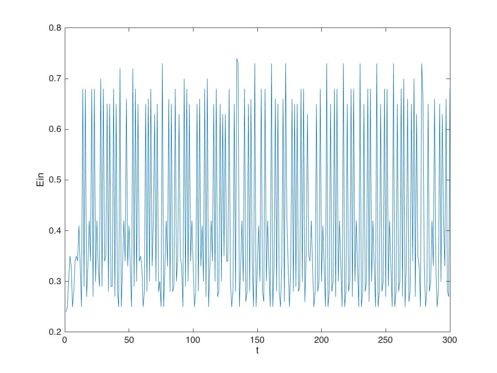
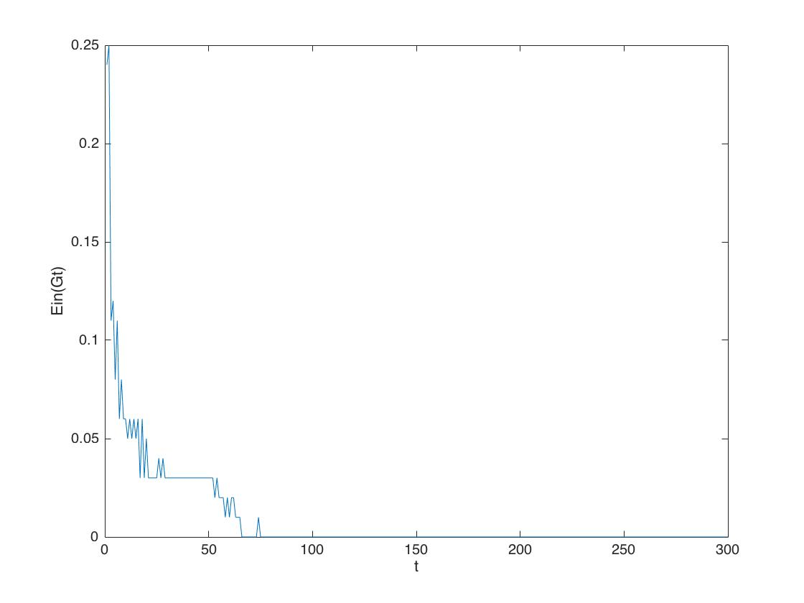
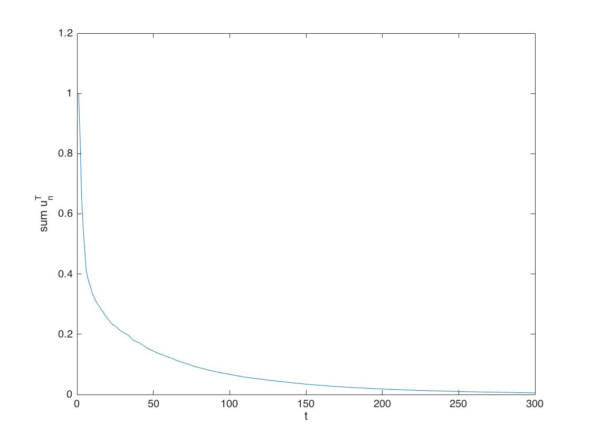
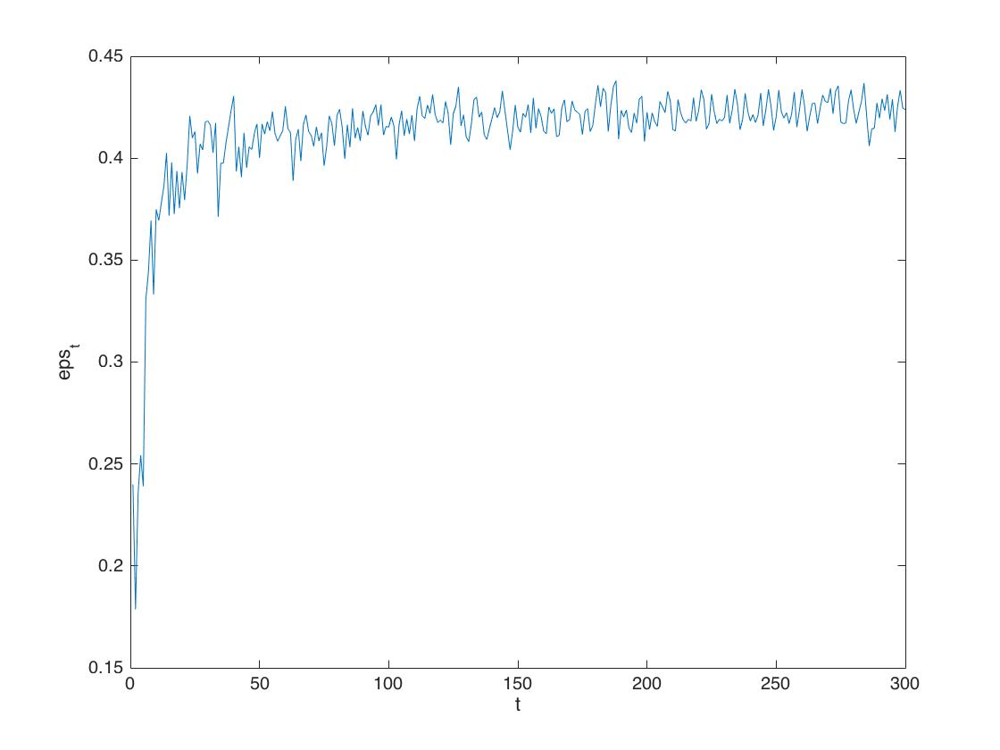
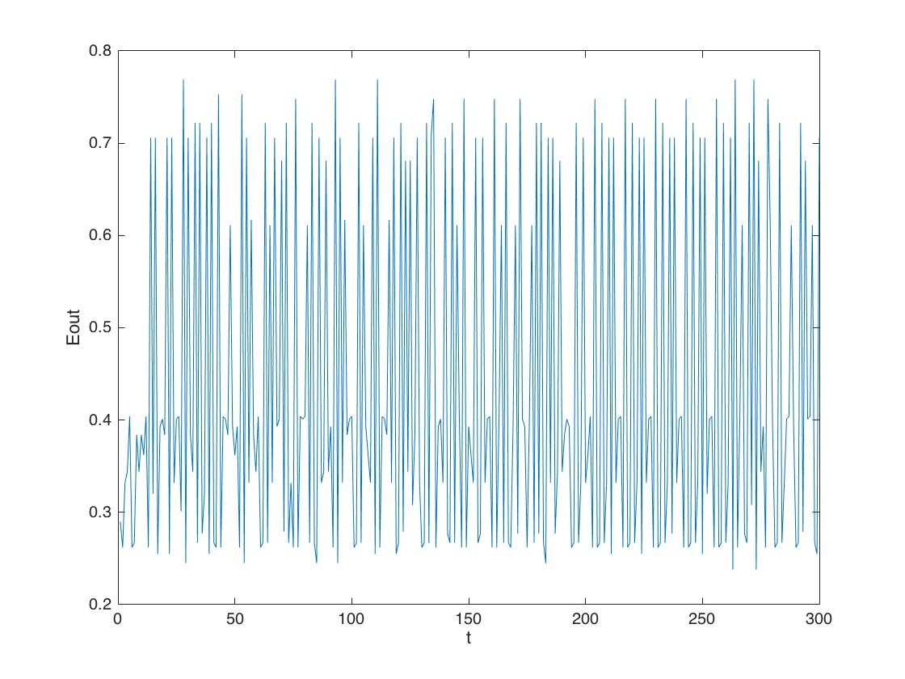
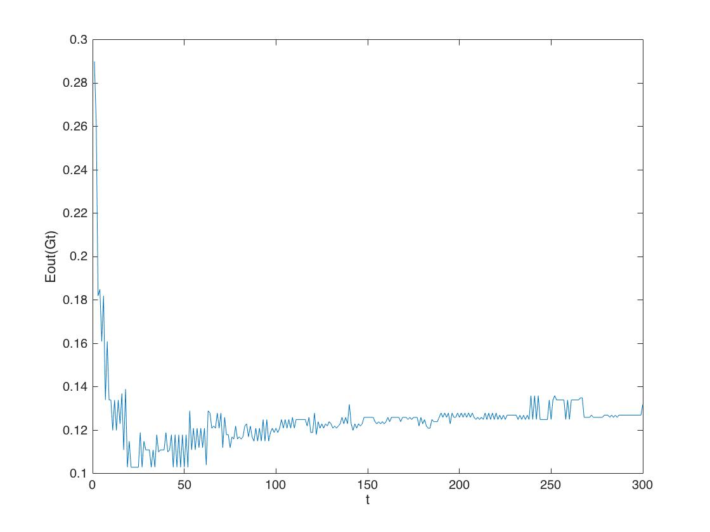

#Machine Learning Homework 6
## R04922034
1.

$$
\begin{aligned}
&\min_{A,B} F(A,B) = \frac{1}{N} \sum_{n=1}^N ln(1+exp(-y_n(A_zn+B)))\\  
&\frac{ \partial F}{\partial A} = \frac{1}{N}\sum_{n=1}^N \frac{1}{1+exp(-y_n(Az_n+B))} exp(-y_n(Az_n+B)) (-y_n(z_n))\\
&=\frac{1}{N} \sum_{n=1}^N p_n(-y_nz_n)\\
&\frac{ \partial F}{\partial B} = \frac{1}{N}\sum_{n=1}^N \frac{1}{1+exp(-y_n(Az_n+B))}exp(-y_n(Az_n+B)) (-y_n)\\
&= \frac{1}{N} \sum_{n=1}^N p_n(-y_n)\\
&\nabla {F}= [\frac{1}{N} \sum_{n=1}^Np_n(-y_nz_n) \quad \frac{1}{N} \sum_{n=1}^Np_n(-y_n)]^T
\end{aligned}
$$
2.
$$
\begin{aligned}
\frac {\partial^2 F} {\partial A^2} &= \frac{\partial \frac{1}{N}\sum_{n=1}^N p_n(-y_nz_n)}{\partial A }\\
&= -\frac{1}{N} \sum_{n=1}^N y_nz_n \frac{\partial p_n}{\partial A}\\
&= -\frac{1}{N} \sum_{n=1}^N y_nz_n \frac{\partial}{\partial A} (1 - \frac{1}{1+exp(-y_n(Az_n+B))})\\
&= -\frac{1}{N} \sum_{n=1}^N y_nz_n \frac{\partial}{\partial A} \frac{-1}{1+exp(-y_n(Az_n+B))}\\
&= -\frac{1}{N} \sum_{n=1}^N y_nz_n(\frac{1}{1+exp(-y_n(Az_n+B))})^2 exp(-y_n(Az_n+B)) (-y_nz_n)\\
&= \frac{1}{N} \sum_{n=1}^N z_n^2(\frac{1}{1+exp(-y_n(Az_n+B))})p_n\\
&= \frac{1}{N} \sum_{n=1}^N z_n^2(1-p_n)p_n\\\\
\frac{\partial^2 F}{\partial A\partial B} &= \frac{\partial \frac{1}{N} \sum_{n=1}^N p_n(-y_n)}{\partial A }\\
&=\frac{1}{N} \sum_{n=1}^N (-y_n) \frac{\partial p_n}{\partial A}\\
&=\frac{1}{N} \sum_{n=1}^N (-y_n) p_n (1-p_n) (-y_nz_n)\\
&=\frac{1}{N} \sum_{n=1}^N z_np_n (1-p_n)\\\\
\frac{\partial^2 F}{\partial B^2} &= \frac{\partial \frac{1}{N}\sum_{n=1}^N p_n(-y_n)}{\partial B} \\
&=\frac{1}{N}\sum_{n=1}^N (-y_n) \frac{\partial p_n}{\partial B}\\
&=\frac{1}{N}\sum_{n=1}^N (-y_n) p_n (1-p_n) (-y_n)\\
&=\frac{1}{N}\sum_{n=1}^N  p_n (1-p_n) \\
H &= \begin{pmatrix}
\frac{1}{N} \sum_{n=1}^N z_n^2(1-p_n)p_n & \frac{1}{N} \sum_{n=1}^N z_np_n (1-p_n) \\
\frac{1}{N} \sum_{n=1}^N z_np_n (1-p_n) & \frac{1}{N}\sum_{n=1}^N  p_n (1-p_n) \\
\end{pmatrix}
\end{aligned}
$$

3.
$$
\beta = (\lambda I + K )^{-1}y\\
w = \sum_{n=1}^N \beta_n z_n
$$
the dimension of the inverted matrix is N
4.
$$
\begin{aligned}
\min_{b,w,\xi_n^\wedge,\xi_n^\vee}\frac{1}{2} w^Tw+C\sum_{n=1}^N((\xi_n^\vee)^2+(\xi_n^\wedge)^2) \mid ||y_n-w^T\phi(x_n)-b| - \epsilon | \leq \xi_n\\
\implies \min_{b,w,\xi_n^\wedge,\xi_n^\vee} \frac{1}{2} w^Tw+ C\sum_{n=1}^N \max{(0,|y_n-w^T\phi(x_n)-b|-\epsilon))}^2
\end{aligned}
$$
Since we only penalize margin violation $\xi_n$ that is greater than $\epsilon$

5.
$$
\begin{aligned}
&\min_{b,w,\xi_n^\wedge,\xi_n^\vee} \frac{1}{2} w^Tw+C\sum_{n=1}^N\max{(0,|y_n-w^T\phi(x_n)-b|-\epsilon))}\\
&\min_{\beta,w} F(b,\beta)=\frac{1}{2}\sum_{n=1}^N \sum_{m=1}^N \beta_n \beta_m K(x_n,x_m)+C\sum_{n=1}^N (\max(0,|y_n-s_n|-\epsilon))^2\\
&\frac{\partial F}{\partial \beta_m} = \frac{1}{2}2\sum_{n=1}^N\beta_nK(x_n,x_m)+2C\sum_{n=1}^N[[|y_n-s_n| > \epsilon]](|y_n-s_n|-\epsilon)sign(|y_n-s_n|)\frac{\partial {-s_n}}{\partial \beta_m}\\
&=\frac{1}{2}2\sum_{n=1}^N\beta_nK(x_n,x_m)-2C\sum_{n=1}^N[[|y_n-s_n|>\epsilon]](|y_n-s_n|-\epsilon)sign(|y_n-s_n|)\\
&\frac{\partial\sum\beta_{m=1}^N \beta_mK(x_n,x_m)+b}{\partial \beta_m}\\
&=\sum_{n=1}^N\beta_nK(x_n,x_m)-2C\sum_{n=1}^N[[|y_n-s_n|>\epsilon]](|y_n-s_n|-\epsilon)sign(|y_n-s_n|)K(x_n,x_m)
\end{aligned}
$$
6.
$$
\begin{aligned}
M e_t = \sum_{m=1}^M g_t(\widetilde x_m)^2 - 2g_t(\widetilde x_m)\widetilde y_m + \widetilde y_m^2\\
Me_t = Ms_t -2\sum_{m=1}^Mg_t(\widetilde x_m)\widetilde y_m + Me_0\\
\sum_{m=1}^Mg_t(\widetilde x_m)\widetilde y_m= \frac{M(s_t + e_0 -e_t)}{2}
\end{aligned}
$$
7.
let a,b denote the two points.
With $$a\neq b$$  we have
$$
\begin{aligned}
y = m(x-a)+a^2\\
m(b-a) + a^2 = b^2\\
\implies m = b+a \iff b\neq a\\
y = (b+a)(x-a)+a^2\\
=(b+a)x-ba -a^2 + a^2\\
=(b+a)x-ba\\
\end{aligned}
$$
The expected value of (b+a) = the expected value of a + expected value of b = 1

let A denote a matrix of size N, where
$$
a_{ij} = {\frac{i}{N}\frac{j}{N}}$$
Then the expected value of
$$ ba  \mid b\neq a$$
is equal to

$$
\begin{aligned}
&\lim_{n\to\infty}\frac{1}{N^2}(\sum_{i=1}^N\frac{i}{N}\sum_{j=1}^N\frac{j}{N}-\sum_{i=1}^N\frac{i^2}{N^2})\\
&=\lim_{n\to\infty}\frac{1}{N^4}(\sum_{i=1}^N{i}\sum_{j=1}^N{j}-\sum_{i=1}^N{i^2})\\
&=\lim_{n\to\infty}\frac{1}{N^4}(\frac{N(N+1)}{2}\frac{N(N+1)}{2}-\frac{N(N+1)(2N+1)}{6})\\
&=\lim_{n\to\infty}\frac{N(N+1)}{2N^4}(\frac{N(N+1)}{2}-\frac{(2N+1)}{3})\\
&=\lim_{n\to\infty} \frac{N(N+1)}{2N^4}(\frac{3N^2+3N-4N-2}{6})\\
&=\frac{1}{4}
\end{aligned}
$$
$$g= x-\frac{1}{4}$$
8.
$$
\begin{aligned}
\min_{w} E_{in}^u(w) = \frac{1}{N} \sum_{n=1}^N u_n(y_n-w^Tx_n)^2\\
= \frac{1}{N}\sum_{n=1}^N (\sqrt{u_n}(y_n-w^Tx_n))^2\\
= \frac{1}{N}\sum_{n=1}^N ((\sqrt{u_n}y_n)-w^T(\sqrt{u_n}x_n))^2\\
\implies \widetilde{x_n}=\sqrt{u_n}x_n \quad \widetilde{y_n}=\sqrt{u_n}y_n
\end{aligned}
$$
9.
After the first iteration, u+ will be timed by num_error / (num_error + num_correct) = 1/100, while u- will be timed by num_correct / (num_error+num_correct) = 99/100.
With
$$
u_{+}^{(1)} =u_{-}^{(1)} = 1\\
u_{+}^{(2)}/u_{-}^{(2)} = \frac{\frac{1}{100}}{\frac{99}{100}} = \frac{1}{99}
$$

10.

2d (R-L)+2 = 2 * 2 ( 6 - 1 ) +2= 22
where R-L is the number of internal sections and the plus 2 is for the all positive / negative case.

11.
K($x$,$x'$) = inner product of decisions on $x$ and $x'$ = size of decision stump - 2(for direction)2(for compensate wrong agreement)=
$$
2d(R-L)+2 -4 \mid x-x^{'}\mid_{1}
$$

12.

Eins(1) =    0.2400
alphas(1) = 0.5763

13.
Ein isn't increasing or decreasing through iterations, mainly because we penalized the right-predicted features throughout the iteration process, which should cause Ein to increase.  After certain amount of iterations, the first assigned penalty will be balanced by penalties given on later iterations, and result in a reduction on Ein.   

14.
Ein(300) =0
15.
u_s(2)=  0.8542
u_s(300)=0.0055

16.
min(eps_s) = 0.1787

17.
Eout(1) = 0.2900

18.
Eout(300) = 0.1320
19.

rs = 32	lambda_index = 1.000000e-03	Ein = 0  
rs = 32	lambda_index = 1	Ein = 0  
rs = 32	lambda_index = 1000	Ein = 0   
rs = 2	lambda_index = 1.000000e-03	Ein = 0  
rs = 2	lambda_index = 1	Ein = 0  
rs = 2	lambda_index = 1000	Ein = 0  
rs = 1.250000e-01	lambda_index = 1.000000e-03  	Ein = 0   
rs = 1.250000e-01	lambda_index = 1	Ein = 3.000000e-02    
rs = 1.250000e-01	lambda_index = 1000	Ein = 2.425000e-01   

20.

rs = 32	lambda_index = 1.000000e-03	Eout = 4.500000e-01  
rs = 32	lambda_index = 1	Eout = 4.500000e-01  
rs = 32	lambda_index = 1000	Eout = 4.500000e-01  
rs = 2	lambda_index = 1.000000e-03	Eout = 4.400000e-01  
rs = 2	lambda_index = 1	Eout = 4.400000e-01  
rs = 2	lambda_index = 1000	Eout = 4.400000e-01  
rs = 1.250000e-01	lambda_index = 1.000000e-03	Eout = 4.600000e-01  
rs = 1.250000e-01	lambda_index = 1	Eout = 4.500000e-01  
rs = 1.250000e-01	lambda_index = 1000	Eout = 3.900000e-01  

\newpage

