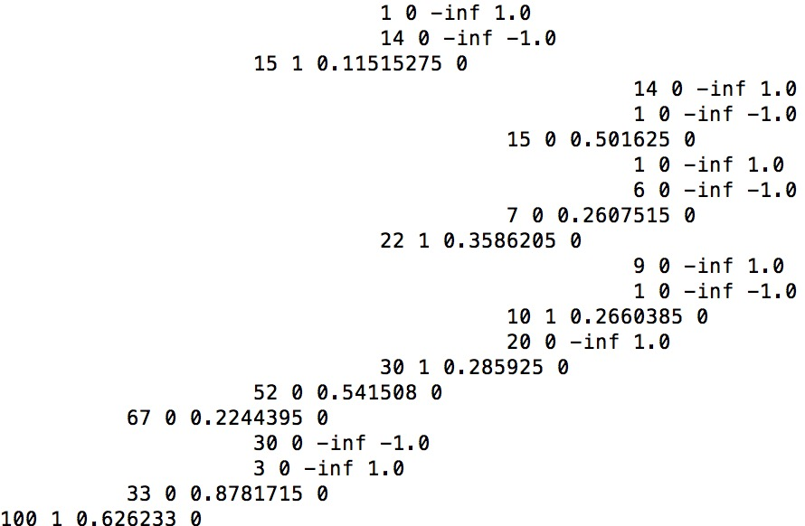
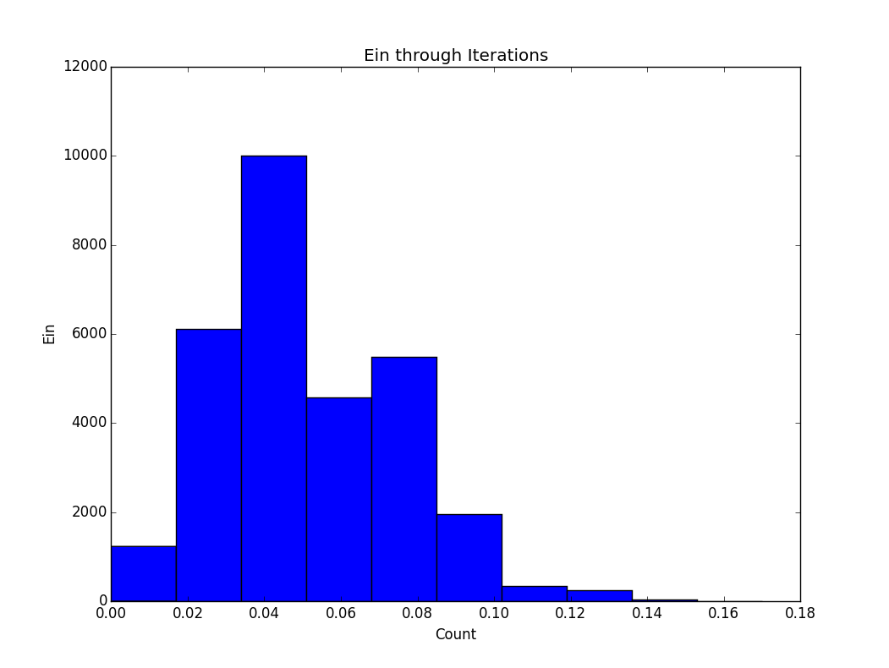
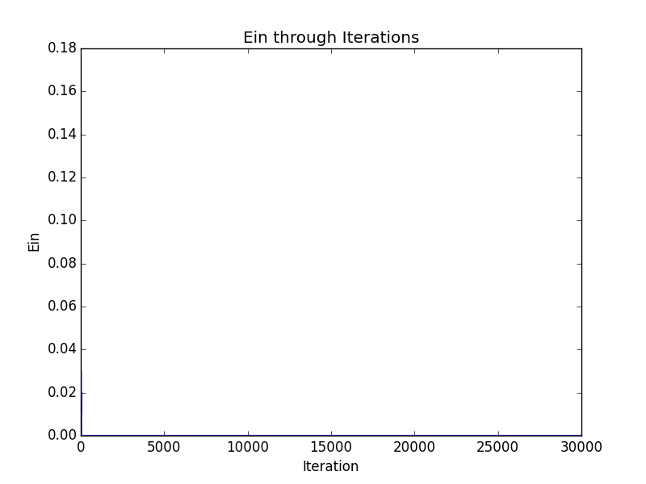
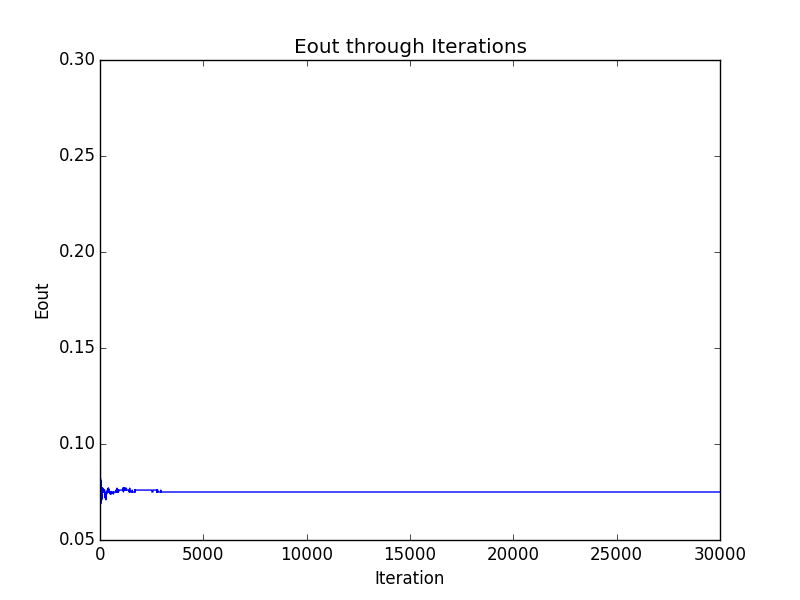

#Machine Learning HW7
R04922034

1.

let
$$
\begin{aligned}
x =  u_{+} , y = u_{-} ,x+y = 1\\
1-x^2-y^2 = 1-x^2-(1-x)^2\\
=1-x^2-1+2x-x^2\\
=-2(x^2-x)\\
=-2(x)(x-1)\\
max = -2(\frac{1}{2})(\frac{1}{2}-1)\\
=\frac{1}{2}
\end{aligned}
$$
2.

$$
\begin{aligned}
x(1-(x-y))^2+y(-1-(x-y))^2\\
=x(1-2(x-y)+(x-y)^2)+y(1+2(x-y)+y^2)\\
=(x+y)-2(x-y)^2+(x+y)(x-y)^2\\
=1 - 2(x-y)^2 + (x-y)^2\\
=1-x^2+2xy-y^2\\
=1-2x^2-2y^2+2xy+(x^2+y^2)\\
=1-2x^2-2y^2+2xy+(x^2+y^2+2xy-2xy)\\
=1-2x^2-2y^2+1\\
=2-2x^2-2y^2\\
=2(1-x^2-y^2)
\end{aligned}
$$
3.

Bootstrapping -> sampling process independent for each input
$$
\begin{aligned}
  N \lim_{N->\infty}(1-1/N)^{pN}\\
  = N (\lim_{N->\infty}(1-1/N)^N)^p
  = Ne^{-p}
\end{aligned}
$$
4.

Let g1 make 15 mistake out of 100 sample
    g2 make 25 mistake out of 100 sample
    g3 make 35 mistake out of 100 sample
In order to minimize Eout, let these mistake be on inputs with no intersection, then no error can get a majority vote, thus Eout = 0. (Since Eout(g1)+Eout(g2)+Eout(g3) < 1 )

In order to maximize Eout, every mistake must get two votes from two hypothesis, thus the maximum Eout is the case when all the mistakes g3 made is also voted by either g1 or g2 => max Eout = 0.35

5.

In order to form a majority in k hypothesis, m = (k+1)/2 votes are needed, and thus the achievable Eout becomes
$$\frac{1}{m} \sum e_k = \frac{2}{K+1}\sum e_k $$

6.

$$
\begin{aligned}
\epsilon_t{\sum u_n^t} = {\sum u_n^t[y_n \neq gt(x_n)]}\\
(1-\epsilon_t){\sum u_n^t} = {\sum u_n^t[y_n = gt(x_n)]}\\
U3 = \sum u_n^3 = \sqrt \frac{1-\epsilon_t}{\epsilon_t}\sum u_n^2[yn \neq gt(x_n)] + \sqrt \frac{\epsilon_t}{1-\epsilon_t}\sum u_n^2[yn = gt(x_n)]\\
=\sqrt{(1-\epsilon_t)(\epsilon_t)}\sum u_n^2 + \sqrt{(1-\epsilon_t)(\epsilon_t)}\sum u_n^2\\
=2\sqrt{(1-\epsilon_2)(\epsilon_2)}\sum u_n^2\\
=4\sqrt{(1-\epsilon_2)(\epsilon_2)}\sqrt{(1-\epsilon_1)(\epsilon_1)}\sum u_n^1\\
=4\sqrt{(1-\epsilon_2)(\epsilon_2)}\sqrt{(1-\epsilon_1)(\epsilon_1)}
\end{aligned}
$$

7.

$$
\begin{aligned}
\alpha = \sum g_1(x_n)(y_n-s_n) / \sum {g_t^2(x_n)}\\
=\frac{2\sum y_n}{4N}
=\frac{1}{2N}\sum{y_n}\\
s_n = 0+\alpha g_t(x_n)\\
=2 \frac{1}{2N}\sum{y_n}\\
= \frac{1}{N}\sum{y_n}\\
\end{aligned}
$$

8.

$$
\begin{aligned}
\sum s_ng_t(x_n) = \sum_n (s_n+ \alpha_tg_t(x_n))g_t(x_n)\\
=\sum_n(s_n g_t(x_n)+\alpha_tg_t^2(x_n))\\
=\sum_n s_ng_t(x_n)+\alpha_t\sum_n g_t^2(x_n)\\
=\sum_ns_n g_t(x_n)+\frac{\sum g_t(x_n)(y_n-s_n)}{\sum g_t^2(x_n)} \sum_n g_t^2(x_n)\\
= \sum_n s_ng_t(x_n) + \sum_n g_t(x_n) y_n - \sum_n g_t(x_n)s_n\\
=\sum y_n g_t(x_n)
\end{aligned}
$$

9.

OR means false only if all xi = -1  
So let wi = 1 for i > = 1 and w0 = d-1  
The false case will only happen when all xi = -1, results in -1 * d + (d-1) = -1 < 0
If at least one xi = 1, then -1 * (d-1) + 1 + (d-1) = -d+1 + 1 + (d-1) = 1 > 0

10.

The smallest D is 5, the network is constructed as follows
We can see that for XOR(x1,x2,x3,x4,x5) to be true, the sum of x1,x2,x3,x4,x5 must be either 5 or 1 or -3
, and thus > 4 or (<2 and > 0) or ( < -2 and > -4)
Let the hidden layer be perceptrons that implement >4 , <2 , >0 , < -2 and > -4. We can observe that, for the result of input to be 1, 3 of the 5 conditions listed above must be satisfied, and thus by performing a > 3 on the output layer can yield the desired result.

11.
Since all initial weights are assigned 0, only those weights respect to constant 1 can somehow preserve value other than 0. => only consider the last layer.
$$
\frac{\partial e_n}{\partial w_{i1}^L}\\=-2(yn-s_1^{L})(x_i^{L-1})
$$
=> take i =0, we can have $x_0^{L-1}$ nonzero  
=> only gradients with repsect to $w_{01}^L$ can be non-zero.

12.

$$
\begin{aligned}
s_j^{(1)} = \sum_{i=0}^{d^0} w_{ij}^{(1)}x_i^{0} = \sum_{i=0}^{d^0} x_i^0\\
x_j^{1} = tanh(s_j^1)=tanh(\sum x_i^0)\\
s_1^{(2)}=\sum_{j=1}^{d^1} w_{j1}^{2}x_j^{(1)}=\sum_{j=1}^{d^1}tanh(\sum x_i^0)\\
x_j^{(2)} = tanh(s_j^{(2)}) = tanh(\sum_{j=1}^{d^1}tanh(\sum x_i^0))\\
e_n = (y_n-x_j^{(2)})^2\\
\frac{\partial e_n}{\partial s}\frac{\partial s}{\partial w} = 0\\
w_{ij}^{(l)} = w_{ij+1}^{(l)}  ,  1 \leq j \leq d^{(l)}+1
\end{aligned}
$$

13.

14.

Ein = 0

15.

Eout = 0.126

16.

17.

18

We can see that , Ein quickly drop to 0 through few iterations while Eout maintains a stable and Error performance throughout the 30000 iterations.

19.

20.

We can see that , since the model we use is extremely simple, which results in a relatively unstable performance and Ein with higher value. We also get Eouts with higher values for the same reason as above.
