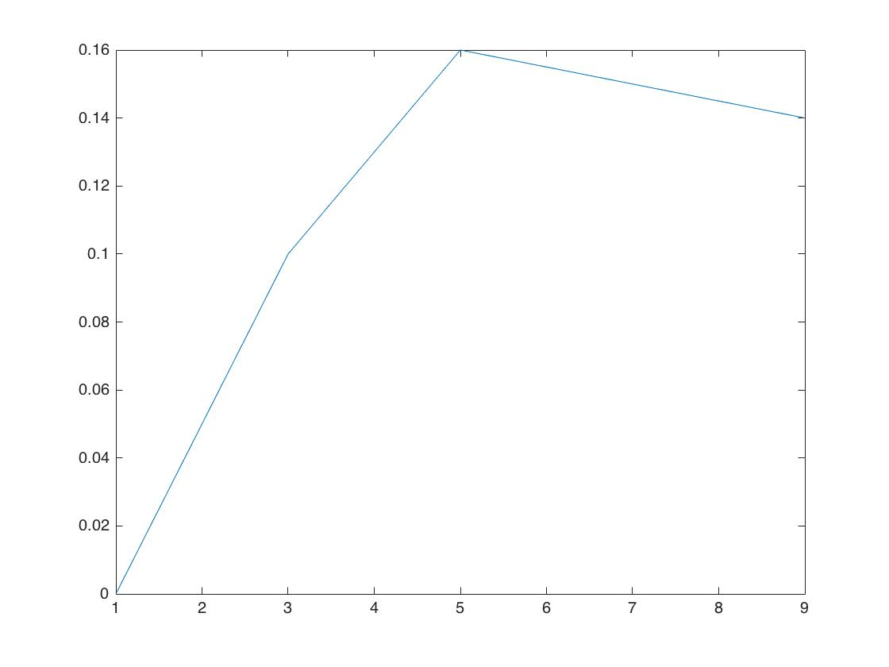
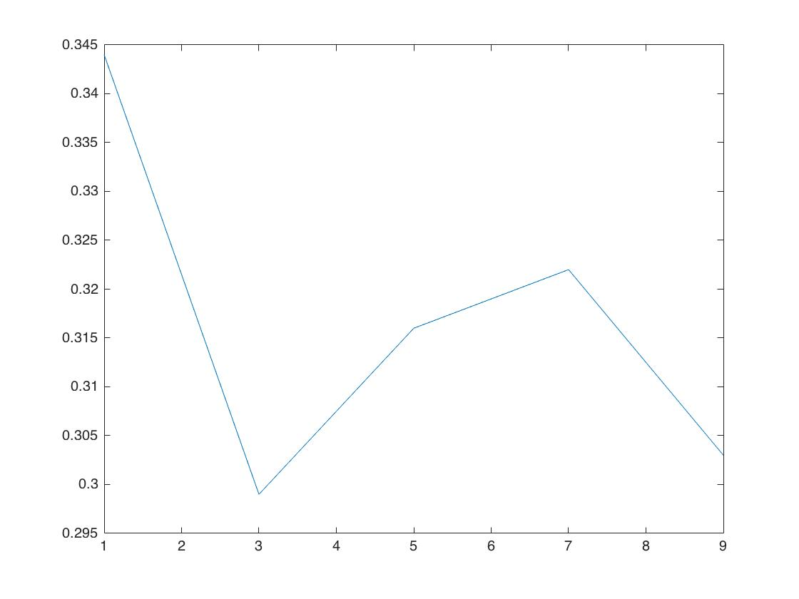
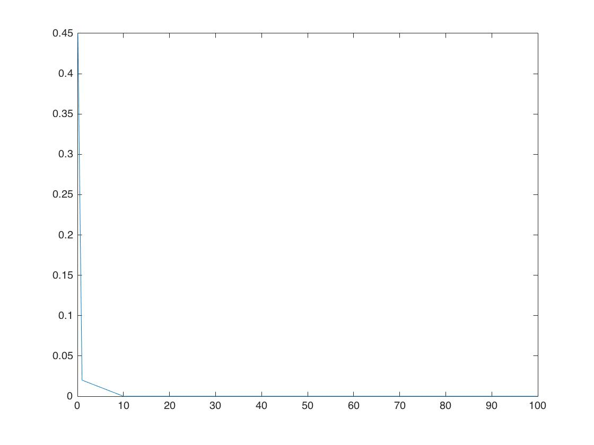
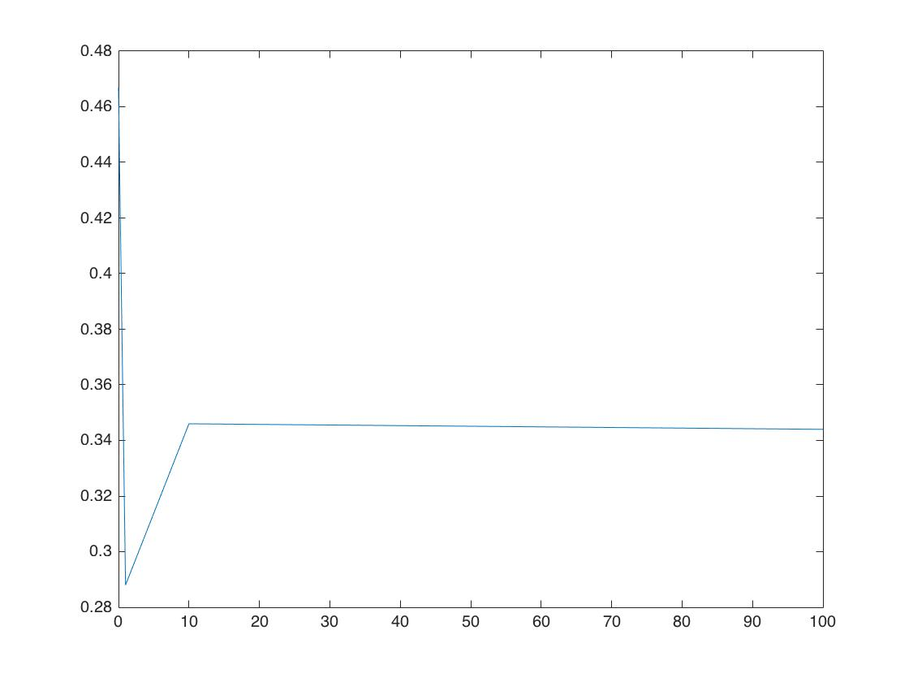
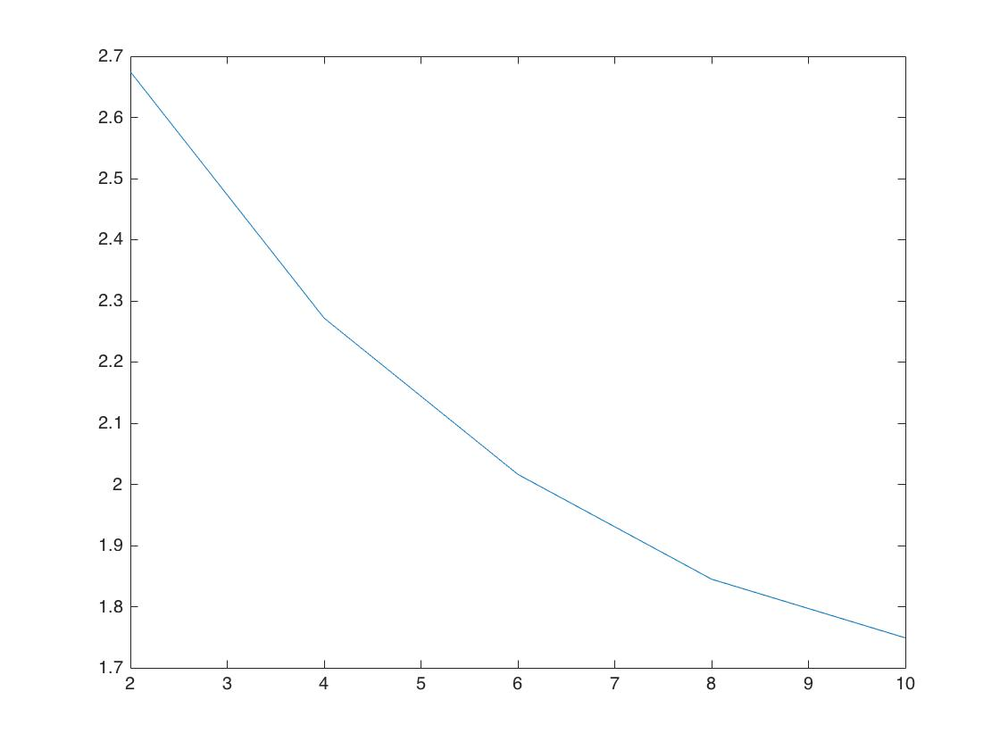

#Machine Learning HW8
R04922034 Hsuan-Heng Wu

1.

Forward computation requires (A+1) * B + (B+1) according to each weight.
Backward computation requires (B+1) weights update , B delta computation and (A+1)B gradient descent
= AB+B+2B+2+B+AB+B = 2AB + 5B + 2  computations

2.

1 [36] 421  
2 [2, 34] 111  
3 [2, 2, 32] 107  
4 [2, 2, 2, 30] 103  
5 [2, 2, 2, 2, 28] 99  
6 [2, 2, 2, 2, 2, 26] 95  
7 [2, 2, 2, 2, 2, 2, 24] 91  
8 [2, 2, 2, 2, 2, 2, 2, 22] 87  
9 [2, 2, 2, 2, 2, 2, 2, 2, 20] 83  
10 [2, 2, 2, 2, 2, 2, 2, 2, 2, 18] 79  
11 [2, 2, 2, 2, 2, 2, 2, 2, 2, 2, 16] 75  
12 [2, 2, 2, 2, 2, 2, 2, 2, 2, 2, 2, 14] 71  
13 [2, 2, 2, 2, 2, 2, 2, 2, 2, 2, 2, 2, 12] 67  
14 [2, 2, 2, 2, 2, 2, 2, 2, 2, 2, 2, 2, 2, 10] 63  
15 [2, 2, 2, 2, 2, 2, 2, 2, 2, 2, 2, 2, 2, 2, 8] 59  
16 [2, 2, 2, 2, 2, 2, 2, 2, 2, 2, 2, 2, 2, 2, 2, 6] 55  
17 [2, 2, 2, 2, 2, 2, 2, 2, 2, 2, 2, 2, 2, 2, 2, 2, 4] 51  
18 [2, 2, 2, 2, 2, 2, 2, 2, 2, 2, 2, 2, 2, 2, 2, 2, 2, 2] 47   

The minimum number of weights can be achieved when these 36 hidden layer are stretched out in to a list of 2 layers (at one node for input and one node for constant 1), resulting in 11 + 18* 2 = 47 weights.

3.

531

A depth first search program shows the maximum number of weights.

1 [36] 421  
2 [22, 14] 531  
3 [21, 13, 2] 487  
4 [20, 12, 2, 2] 445  
5 [19, 11, 2, 2, 2] 405  
6 [18, 10, 2, 2, 2, 2] 367  
7 [17, 9, 2, 2, 2, 2, 2] 331  
8 [16, 8, 2, 2, 2, 2, 2, 2] 297  
9 [15, 7, 2, 2, 2, 2, 2, 2, 2] 265  
10 [14, 6, 2, 2, 2, 2, 2, 2, 2, 2] 235  
11 [13, 5, 2, 2, 2, 2, 2, 2, 2, 2, 2] 207  
12 [12, 4, 2, 2, 2, 2, 2, 2, 2, 2, 2, 2] 181  
13 [11, 3, 2, 2, 2, 2, 2, 2, 2, 2, 2, 2, 2] 157  
14 [10, 2, 2, 2, 2, 2, 2, 2, 2, 2, 2, 2, 2, 2] 135  
15 [8, 2, 2, 2, 2, 2, 2, 2, 2, 2, 2, 2, 2, 2, 2] 113  
16 [6, 2, 2, 2, 2, 2, 2, 2, 2, 2, 2, 2, 2, 2, 2, 2] 91  
17 [4, 2, 2, 2, 2, 2, 2, 2, 2, 2, 2, 2, 2, 2, 2, 2, 2] 69  
18 [2, 2, 2, 2, 2, 2, 2, 2, 2, 2, 2, 2, 2, 2, 2, 2, 2, 2] 47  

When the layer depth is reduced, it is always more encouraging to add the two layers to the first two columns to maximize number of weights. After the first layer achieves 10 ,the same number of the original input layer, will the second column starts growing.

4.

$$
\begin{aligned}
\frac{\partial (x_n-ww^Tx_n)^T(x_n-ww^Tx_n)}{\partial w} \\=
\frac{\partial  (x_n^Tx_n - 2x_n^Tww^Tx_n +x_n^Tww^Tww^Tx_n)}{\partial w} \\=
\frac{\partial -2(x_n^Tw)^2+(x_n^Tw)^2w^Tw}{\partial w} \\=
-4(x_n^Tw)x_n+2(x_n^Tw)x_nw^Tw+(x_n^Tw)^22w
\end{aligned}
$$

5.

$$
\begin{aligned}
\mathbb{E}(Ein(w)) \\= \frac{1}{N}\sum_{n=1}^N norm(x_n-ww^Tx_n)^2-\mathbb{E}(2(x_n^T,w)(w^T\epsilon_n)+2(x_n^T,w)(w^T\epsilon_n)(w^T,w)+(\epsilon_n^Tw)(w^Tw)(w^T\epsilon_n))
\\=\frac{1}{N}\sum_{n=1}^N norm(x_n-ww^Tx_n)^2+(\mathbf{w^T}\mathbf{w})^2
\end{aligned}
$$

6.

x should be classified as 1 when it is nearer to $x_{+}$
thus

$$
\begin{aligned}
(x_{-}-x)^T(x_{-}-x) - (x_{+}-x)^T(x_{+}-x)
\\=norm(x_{-})^2-norm(x_{+})^2-2<x_{-},x>+2<x_{+},x>
\\=norm(x_{-})^2-norm(x_{+})^2+2<x_{+}-x_{-},x>
\\w =2 x_{+}-x_{-}
\\b=norm(x_{-})^2-norm(x_{+})^2
\end{aligned}
$$

7.

$$
\begin{aligned}
\beta_{+}exp(-norm(x-u_{+})^2) > -\beta_{-}exp(-norm(x-u_{-})^2)\\
\implies abs(\beta_{+})exp(-norm(x-u_{+})^2) > abs(\beta_{-}) exp(-norm(x-u_{-})^2)\\
\implies abs(\frac{\beta_{+}}{\beta_{-}})exp(-norm(x-u_{+})^2) > exp(-norm(x-u_{-})^2)\\
\implies abs(\frac{\beta_{+}}{\beta_{-}})exp(-x^Tx+2u_{+}^Tx-u_{+}^Tu_{+}) > exp(-x^Tx+2u_{-}^Tx-u_{-}^Tu_{-})\\
\implies ln(abs(\frac{\beta_{+}}{\beta_{-}}))+(-x^Tx+2u_{+}^Tx-u_{+}^Tu_{+}) > (-x^Tx+2u_{-}^Tx-u_{-}^Tu_{-})\\
\implies ln(abs(\frac{\beta_{+}}{\beta_{-}}))+(2u_{+}^Tx-u_{+}^Tu_{+}) > (2u_{-}^Tx-u_{-}^Tu_{-})\\
\implies
ln(abs(\frac{\beta_{+}}{\beta_{-}}))+2<(u_{+}^T-u_{-}^T),x>-norm(u_+)^2+norm(u_-)^2\\
w=2(u_{+}^T-u_{-}^T)\\
b=ln(abs(\frac{\beta_{+}}{\beta_{-}}))-norm(u_+)^2+norm(u_-)^2
\end{aligned}
$$

8.

Since RBF (x,$\mu$) = [[x = $\mu$]] will only be 1 when input matches some data point, then by setting
$$
\beta_m = y_m
$$
we'll be able to produce perfect prediction on data in the training set.

9.

$$
\begin{aligned}
\frac{\partial \sum_{m=1}^M (\sum_{(x_n,r_{nm} \in D_m)}(r_{nm}-w_m^Tv_n)^2)}{\partial m}
\\= \frac{\partial \sum_{(x_n,r_{nm} \in D_m)}(r_{nm}-w_m^Tv_n)^2}{\partial m}
\\= \sum_{(x_n,r_{nm} \in D_m)}2(r_{nm}-w_m^Tv_n)(-v_n) =0
\end{aligned}
$$
Since $\tilde{d}$ =1
$$
\begin{aligned}
w_m = w_m^T = \frac{\sum r_{nm} v_n}{\sum v_n^2}
\end{aligned}
$$
Which is equal to the average rating of movie since v are 1s.

10.

$$
\begin{aligned}
\max v_{N+1}^Tw_m \\=
\max \frac{1}{N} \sum_{n=1}^N v_N^Tw_m
\end{aligned}
$$
Is the movie with largest average weight.

12.

k= 1 Ein = 0.000000  
k= 3 Ein = 0.100000  
k= 5 Ein = 0.160000  
k= 7 Ein = 0.150000  
k= 9 Ein = 0.140000  

k= 1 yields 0 Ein naturally, and starts increasing as k goes up. However, as the k grows further up, majority voting starts to demonstrate its power and result in the decrease of Ein.

14.

k= 1 Eout  = 0.344000  
k= 3 Eout  = 0.299000  
k= 5 Eout  = 0.316000  
k= 7 Eout  = 0.322000  
k= 9 Eout  = 0.303000  

Eout , on the other hand, has the highest value at k=1, due to the fact that 1 nearest neighbor is basically not doing clustering at all, but rather similar to interpolation. As k increases, we can't conclude a monotonic growth or decline on Eout, but in general we could expect it to yield stable performance with a reasonable number of k.

16.

r = 0.001000 , Ein = 0.450000  
r = 0.100000 , Ein = 0.450000  
r = 1.000000 , Ein = 0.020000  
r = 10.000000 , Ein = 0.000000  
r = 100.000000 , Ein = 0.000000  

This graph demonstrated that, as a very powerful kernel(transformation), uniform RBF is able to minimize Ein to 0 within quite small value of gamma.

18.

r = 0.001000 , Eout = 0.467000  
r = 0.100000 , Eout = 0.448000  
r = 1.000000 , Eout = 0.288000  
r = 10.000000 , Eout = 0.346000  
r = 100.000000 , Eout = 0.344000  

On the other hand, due to the fact that our model fits the Training data perfectly, we see Eout performance stuck at constant value.  

20.

k = 2 , error = 2.674642  
k = 4 , error = 2.271828  
k = 6 , error = 2.016366  
k = 8 , error = 1.844964  
k = 10 , error = 1.749014  

We can observe that, by increasing the number of clustering seed, we are able to generate complex model that to clustering well.
